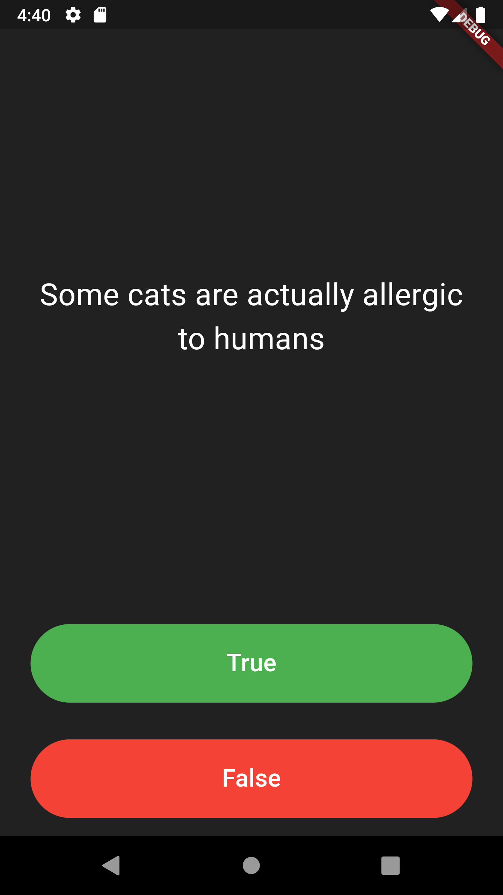

# Quizzler ❓

## Mon objectif
Dans ce tutoriel, je vais réviser les widgets Stateful et Stateless tout en apprenant les fondements de la programmation orientée objet (POO) - les classes et les objets.

## Ce que j'ai créé
Je vais réaliser une application de quiz qui teste mes connaissances générales. En tant que l'un des types d'applications les plus populaires sur les stores, je vais créer mon propre quiz pour que d'autres puissent en profiter !

## Application terminée

## Ce que j'ai appris
- Modulariser mon code en classes séparées.
- Comprendre les classes et les objets en Dart.
- Utiliser les constructeurs de classes.
- Extraire des widgets pour refactoriser mon code.
- Utiliser des modificateurs privés et publics en Dart.
- Manipuler des listes en Dart.
- Comprendre la différence entre `var`, `const` et `final`.
